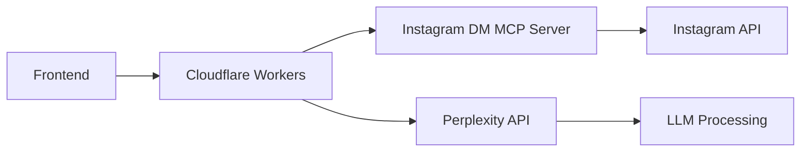
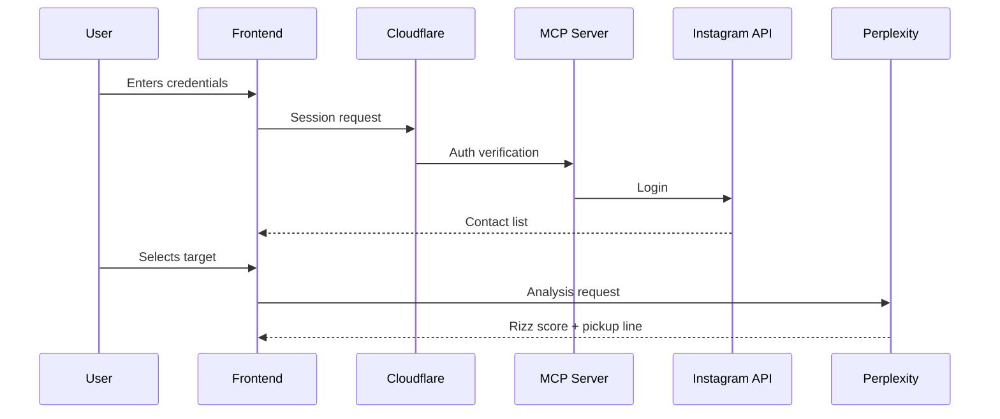

## justRizz: AI-Powered Instagram Dating Coach

### Overview

justRizz is an AI dating coach application that leverages Instagram's messaging system to help users craft personalized pickup lines. The app integrates Instagram's DM capabilities via the MCP server, profile analysis using instagrapi, and Perplexity API for LLM-powered insights. Users authenticate with Instagram, select a target contact, and receive a "rizz score" with customized pickup lines based on comprehensive profile analysis.

### Technical Architecture




### Core Features

1. **Instagram Authentication**
    - Secure OAuth-based login flow
    - Session management with token encryption
    - Credential validation against Instagram API
2. **Target Selection Interface**
    - Dynamic user list from DM history
    - Search/filter functionality
    - Profile preview cards with last interaction timestamp
3. **Rizz Score Analysis**

```python
def calculate_rizz_score(chat_history, profile_data):
    engagement = analyze_response_rate(chat_history)
    compatibility = compare_interests(user_profile, profile_data)
    return (engagement * 0.7 + compatibility * 0.3) * 100
```

4. **Profile Data Extraction**
    - **Bio analysis**: Keyword extraction and sentiment scoring
    - **Visual analysis**: Dominant colors in profile picture
    - **Content patterns**: Hashtag frequency analysis
    - **Post analysis**: Caption sentiment and engagement metrics
5. **Pickup Line Generation**

```python
prompt = f"""
Generate pickup line for {target_name} based on:
- Bio: {bio_keywords}
- Interests: {top_hashtags}
- Visual style: {color_palette}
- Chat history tone: {conversation_tone}
"""
response = perplexity_api(prompt, model="sonar-pro")
```


### Implementation Plan

#### Phase 1: MCP Server Deployment

1. **Cloudflare Worker Setup**

```bash
wrangler generate justrizz-mcp https://github.com/trypeggy/instagram_dm_mcp
```

2. **Configuration**

```python
# wrangler.toml
name = "justrizz-mcp"
compatibility_date = "2025-06-24"
[vars]
INSTAGRAM_USERNAME = "{{ secrets.USERNAME }}"
INSTAGRAM_PASSWORD = "{{ secrets.PASSWORD }}"
```


#### Phase 2: Frontend Integration

1. **User Flow**



2. **Key Components**
    - **Profile Card Component**: Displays target's DP, bio, and engagement metrics
    - **Chat Viewer**: Message history with sentiment color-coding
    - **Rizz Meter**: Visual score indicator with improvement tips

#### Phase 3: Perplexity API Integration

```python
from openai import OpenAI

client = OpenAI(
    api_key="pplx-...",
    base_url="https://api.perplexity.ai"
)

def generate_pickup_line(context):
    response = client.chat.completions.create(
        model="sonar-pro",
        messages=[{
            "role": "system",
            "content": "Generate Instagram pickup line based on:"
            f"Target interests: {context['hashtags']}\n"
            f"Conversation history: {context['chat_summary']}\n"
            f"Profile keywords: {context['bio_keywords']}"
        }]
    )
    return response.choices[^0].message.content
```


### Security Measures

- **Credential Handling**: Never store Instagram credentials (use session tokens)
- **Data Encryption**: AES-256 for all profile data in transit
- **Rate Limiting**: 3 pick up lines per day per user
- **Permission Scopes**: Read-only access to DMs and public profile data


### Timeline

1. MCP server deployment on Cloudflare
2. Frontend MVP with authentication
3. Profile analysis integration
4. Perplexity API integration and testing

### Risks \& Mitigation

| Risk | Mitigation |
| :-- | :-- |
| Instagram API changes | Webhook monitoring + fallback scraping |
| LLM content quality | Prompt engineering + human review layer |
| Profile data accuracy | Multi-source verification |
| User adoption | Gamification (weekly rizz challenges) |

This implementation delivers a complete Instagram dating assistant that transforms profile analysis into actionable dating insights. The Cloudflare-hosted MCP server ensures real-time access to DMs while Perplexity's LLM provides context-aware pickup line generation.

<div style="text-align: center">⁂</div>

[^1]: https://campus.buildclub.ai/challenges/01978a6b-c2b7-7647-bdf5-b83c7888aef2

[^2]: https://github.com/trypeggy/instagram_dm_mcp

[^3]: https://blog.cloudflare.com/streamable-http-mcp-servers-python/

[^4]: https://www.reddit.com/r/CloudFlare/comments/143pmyk/can_i_deploy_my_own_python_backend_code_to_my/

[^5]: https://playbooks.com/mcp/instagram-direct-messages

[^6]: https://www.reddit.com/r/mcp/comments/1jirrm3/mcppowered_agent_controlling_a_web_app_frontend/

[^7]: https://github.com/jlbadano/ig-mcp

[^8]: https://github.com/subzeroid/instagrapi

[^9]: https://www.perplexity.ai/hub/blog/introducing-pplx-api

[^10]: https://github.com/RMNCLDYO/perplexity-ai-toolkit

[^11]: https://community.cloudflare.com/t/introducing-one-click-remote-mcp-servers-with-cloudflare/795791

[^12]: https://zuplo.com/blog/2025/03/28/perplexity-api

[^13]: https://community.cloudflare.com/t/deploying-python-based-mcp-server-on-cloudflare-workers/791912

[^14]: https://docs.livekit.io/agents/integrations/llm/perplexity/

[^15]: https://www.youtube.com/watch?v=Pjc8cC8zVRY

[^16]: https://huggingface.co/blog/lynn-mikami/remote-mcp-cloudflare

[^17]: https://webflow.copilotkit.ai/blog/add-an-mcp-client-to-any-react-app-in-under-30-minutes

[^18]: https://stytch.com/docs/guides/connected-apps/mcp-servers

[^19]: https://apidog.com/blog/instagrapi/

[^20]: https://subzeroid.github.io/instagrapi/usage-guide/media.html

[^21]: https://github.com/subzeroid/instagrapi/blob/master/docs/usage-guide/account.md

[^22]: https://docs.perplexity.ai/guides/getting-started

[^23]: https://community.n8n.io/t/using-perplexity-api-with-the-ai-tools-agent/54308

[^24]: https://llamahub.ai/l/llms/llama-index-llms-perplexity?from=

[^25]: https://www.reddit.com/r/mcp/comments/1kkzv93/learn_how_to_deploy_your_mcp_server_using/

[^26]: https://community.cloudflare.com/t/can-i-deploy-my-own-python-backend-code-to-my-domain/519191

[^27]: https://github.com/cloudflare/python-workers-examples/blob/main/README.md

[^28]: https://docs.copilotkit.ai/guides/model-context-protocol

[^29]: https://stytch.com/blog/building-an-mcp-server-oauth-cloudflare-workers/

[^30]: https://forum.cursor.com/t/how-to-implement-a-mcp-server-with-auth-and-trigger-cursor-login/100433

[^31]: https://github.com/roy845/Fullstack-Instagram-Clone

[^32]: https://apify.com/ahmedemad9112/automate-initial-dm-instagram/api/mcp

[^33]: https://www.sitepoint.com/conquering-instagram-with-php-and-the-instagram-api/

[^34]: https://subzeroid.github.io/instagrapi/usage-guide/story.html

[^35]: https://pypi.org/project/instagrapi/

[^36]: https://github.com/debdutgoswami/instagram-profile-picture

[^37]: https://chromewebstore.google.com/detail/instagram-scraper-export/ddijhlpnokdnogjedjpemidaoicflael

[^38]: https://palospublishing.com/scrape-instagram-hashtags/

[^39]: https://stackoverflow.com/questions/75075485/how-to-scrape-user-data-and-usernames-with-instagrapi

[^40]: https://docs.perplexity.ai/home

[^41]: https://gist.github.com/onelouder/ac1bc3c3ec52d9b63b2a7d12d9c35bf8

[^42]: https://github.com/kirkryan/perplexity-api

